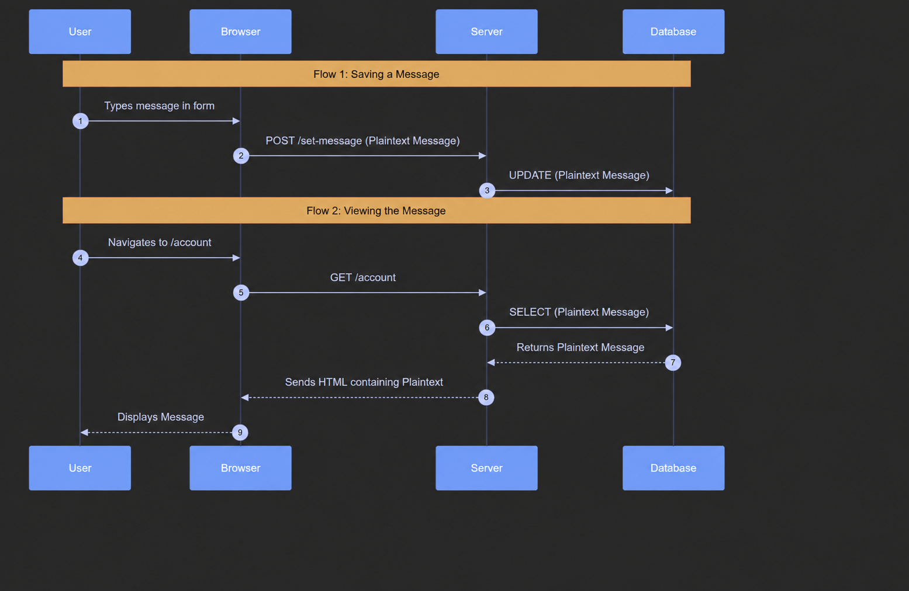
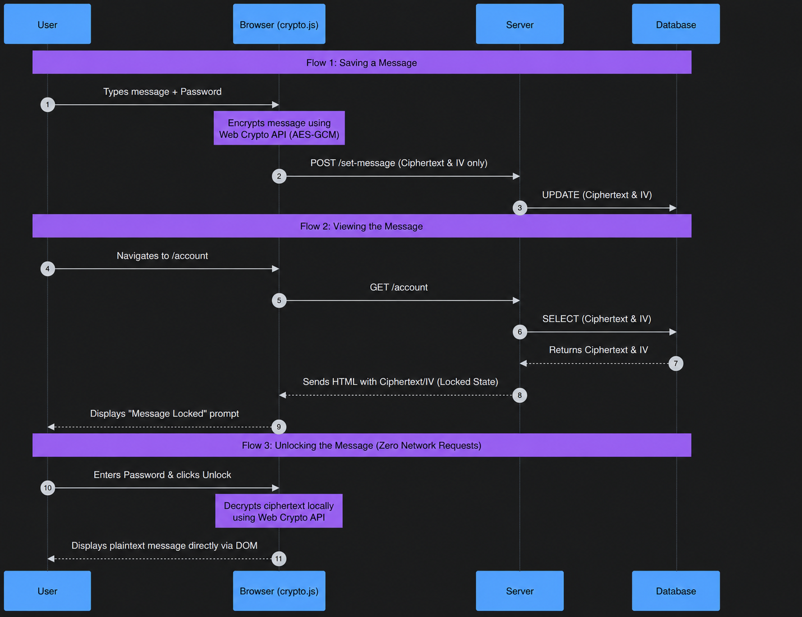

# CS_Lab_1

Video demonstration: https://drive.google.com/file/d/1GXxJ4OALZJAgupHLm78vAKwjd7UZBaZX/view?usp=sharing

A simple class portal where students can log in, set a personal message,
and view an encrypted message flow on their own page.

## Architecture

The project is built as a small Express app with a SQLite database and
browser-side crypto for the message feature.





## Features

- Log in with a username and password
- View your own page with a welcome message
- Set a personal message through the encrypted message flow
- Unlock the stored message client-side with the correct password
- Change your password any time

## Tech Stack

- [Node.js](https://nodejs.org/) with [Express](https://expressjs.com/)
- [better-sqlite3](https://github.com/WiseLibs/better-sqlite3) for storage
- Plain HTML/CSS, no front-end framework
- Browser Web Crypto API for hashing, encryption, and decryption

## Getting Started

1. Install dependencies:

   ```bash
   npm install
   ```

2. Start the server:

   ```bash
   npm start
   ```

3. Open your browser to [http://localhost:3000](http://localhost:3000)

The database (`classmates.db`) is created automatically the first time
you run the app, with a few sample accounts to log in with.

## Project Structure

```
classmate-hub/
├── server.js              # app entry point
├── db.js                  # database setup
├── views.js                # shared page template
├── routes/
│   ├── login.js           # login page
│   ├── account.js         # account page + logout
│   ├── message.js         # set message page
│   └── password.js        # change password page
└── public/
    ├── crypto.js          # browser crypto helpers
    └── style.css          # styling
```

## Configuration

By default the app runs on port `3000`. To use a different port, set
the `PORT` environment variable before starting:

```bash
PORT=8080 npm start
```
